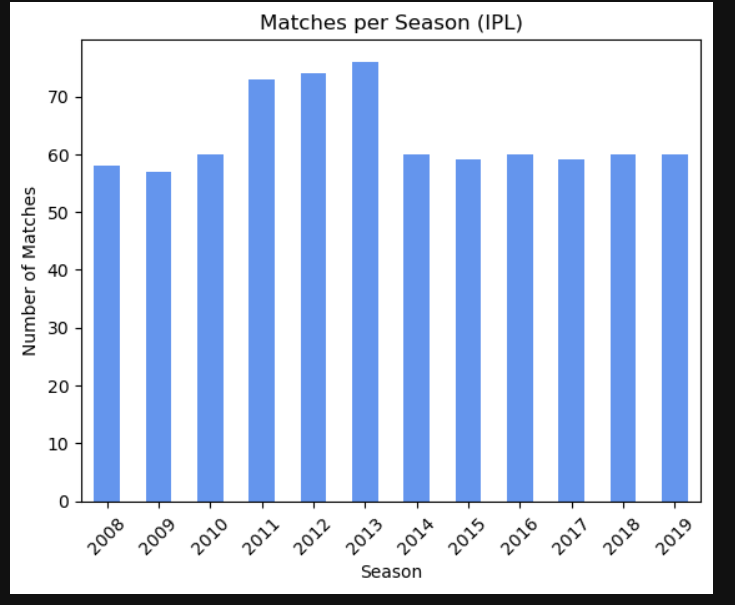
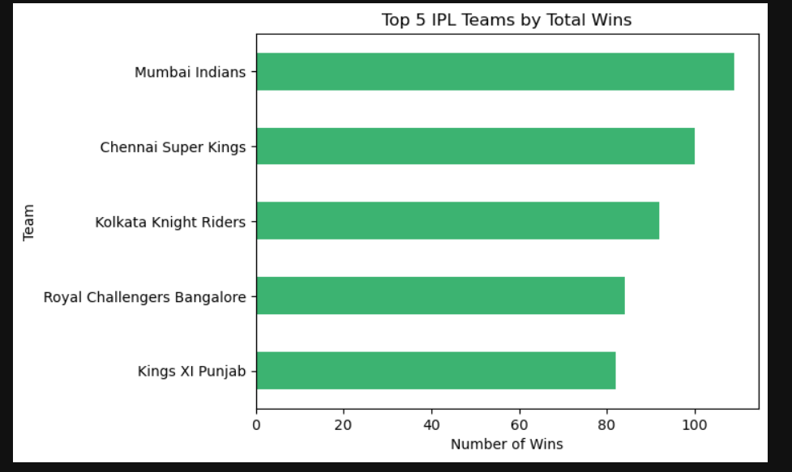
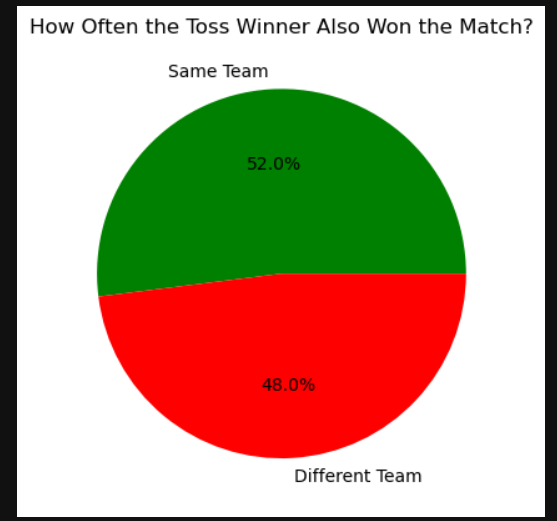

# 🏏 IPL Match Analysis (2008–2019)

This project explores IPL match data from 2008 to 2019 using Python and Pandas.

We'll analyze match-level trends like:
- Matches played each season
- Top teams by total wins
- How often toss winners also win the match

The goal is to extract insights and practice data cleaning, analysis, and visualization.

---

## 📊 Key Insights

- Mumbai Indians and CSK have the highest number of wins across all seasons.
- The number of IPL matches increased early on and stabilized by 2013.
- The toss-winning team won the match only **~52%** of the time.

---

## 🧰 Tools Used

- Python
- Pandas
- Matplotlib
- Seaborn
- Jupyter Notebook

---

## 📁 Project Files

- `IPL_Match_Analysis_Cleaned.ipynb` – Main notebook
- `matches.csv` – Dataset from [Kaggle](https://www.kaggle.com/datasets/ramjidoolla/ipl-data-set)

---

## 📷 Sample Charts

### Matches per Season


### Top 5 Teams by Wins


### Toss Winner vs Match Winner


---

## 📈 How to Run

1. Download the notebook and dataset.
2. Run in Jupyter Lab or Jupyter Notebook.
3. Install required packages with:
   ```bash
   pip install pandas matplotlib seaborn
   ```

---

## 📌 Future Ideas

- Analyze player-level stats using deliveries.csv
- Explore home vs away team performance
- Build a machine learning model to predict match outcomes
